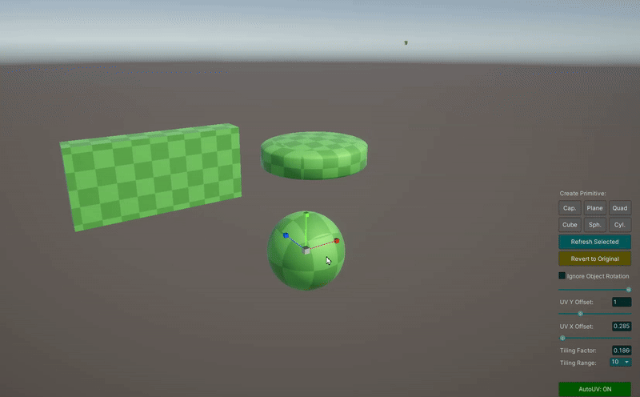

# Auto UV Scaler for Unity

A non-destructive UV mapping tool for quick level prototyping in Unity.

## Overview

Auto UV Scaler is a Unity Editor tool that simplifies the process of UV mapping for level prototyping. It allows you to quickly apply box projected UVs to your meshes in real-time, without permanently modifying the original assets.

## Key Features

- **Non-destructive workflow** - All original meshes are preserved and can be restored at any time
- **Real-time UV adjustments** - Change UV tiling and offset while scaling objects
- **Bulk processing** - Apply UV changes to multiple objects at once
- **Quick primitive creation** - Spawn common primitives with your specified material
- **Scene view controls** - Adjust settings directly in the scene view for better workflow
- **Box projection mapping** - Automatically generate clean UVs based on object geometry
- **Persistent references** - References to original meshes are saved in a ScriptableObject

## Use Cases

- Rapid level prototyping
- Setting up blockout meshes with proper texture tiling
- Creating test environments quickly
- Applying consistent texturing across complex objects
- Non-permanent mesh modification for experimentation

## How to Use

1. Open the tool via **Tools > Roundy > Auto UV Scaler**
2. Select a root object containing the meshes you want to process
3. Toggle "AutoUV: ON" to enable real-time UV adjustments
4. Adjust tiling factor and UV offset as needed
5. Scale objects normally - UVs will update automatically
6. Use "Generate UVs Now" to process multiple objects at once
7. If needed, revert to original meshes with "Revert to Original"

## Scene View Controls

When the AutoUV mode is enabled, convenient controls appear in the scene view:
- Tiling and offset sliders
- Primitive creation buttons
- Rotation handling toggle
- Refresh and revert options

## Installation

1. Download the latest release package from the [Releases](https://github.com/roundyyy/Auto-UV-Scaler/releases) page and import to your Unity project
2. Open the tool window via **Tools > Roundy > Auto UV Scaler**
3. Start creating or modifying meshes for your level prototype

## Requirements

- Unity 2019.4 or newer
